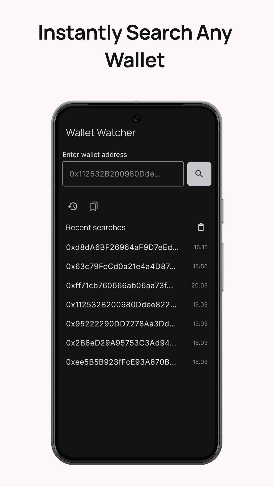
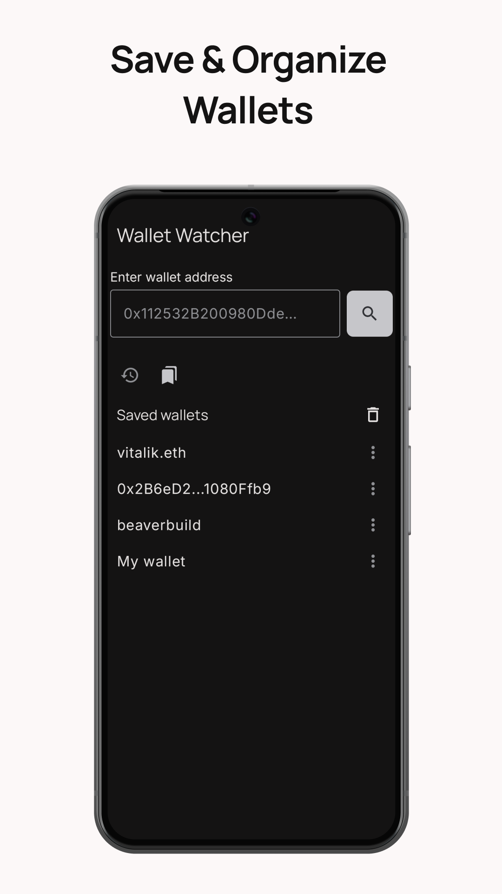
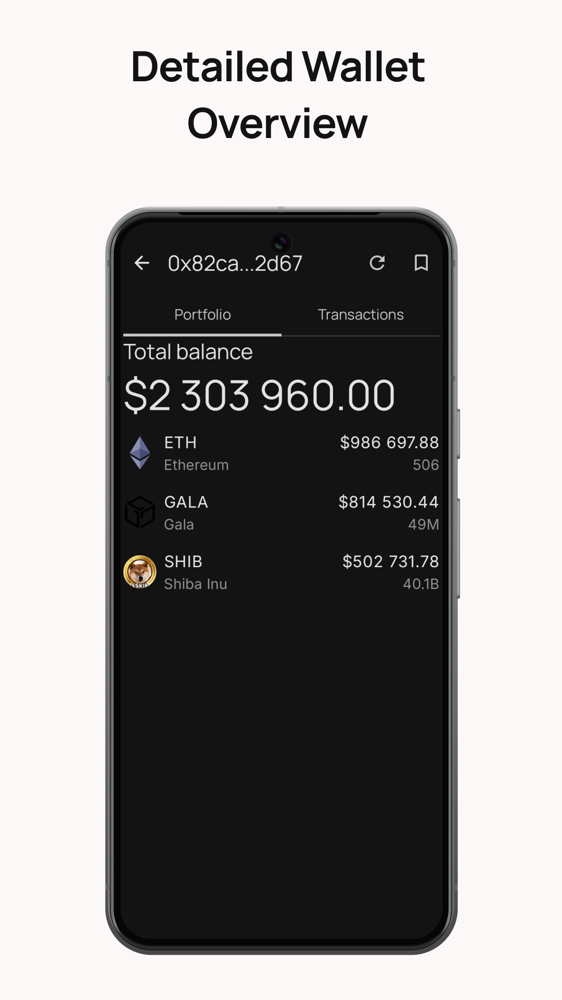
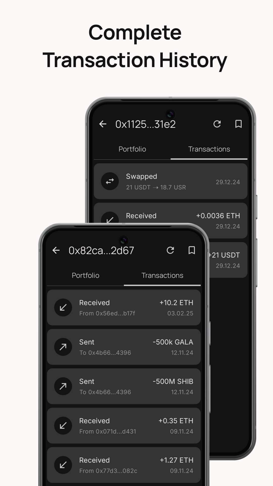

# Wallet Watcher

Wallet Watcher is an Android app for checking Ethereum* wallet balances and transaction history. Instantly view the number of tokens in any wallet, their value in USD, and the latest transactions. Save wallets for quick access and name them for better organization.

*Support for additional blockchains is planned for [future updates](#development-roadmap).**

<div align="center">
  
  
  
  
  
  
</div>

<br>

<div align="center">
  
  [](#download)
  
</div>

<div align="center">
  
[](https://github.com/6SUPER6SONIC6/WalletWatcher/releases)
[](https://github.com/6SUPER6SONIC6/WalletWatcher/releases)

</div>

## ⚡ Features

- 🔍 **Instant Balance Check** – View any Ethereum wallet's balance and assets.  
- 📊 **Detailed Token Breakdown** – See the number of tokens and their USD value.  
- 📜 **Transaction History** – Browse the last 1000 transactions of any wallet.  
- ⭐ **Save Wallets** – Quickly access frequently checked wallets with custom names.  
- 🕵️‍♂️ **Search History** – Auto-save previously searched wallets for convenience.

## 🛠 Tech Stack  

**UI:** Material Design 3, Jetpack Compose, Jetpack Navigation Compose  

**Storage:** Room  

**Networking:** Ktor Client, Kotlinx Serialization  

**Lifecycle & Architecture:** ViewModel, StateFlow, Lifecycle Components  

**Dependency Injection:** Hilt, Hilt Navigation Compose  

**Asynchronous Processing:** Kotlin Coroutines, Flow  

**Architecture:** MVVM (Model-View-ViewModel)

## 🌐 Data Source

**Wallet Watcher** fetches wallet balances and transaction history using the **[Ethplorer API](https://github.com/EverexIO/Ethplorer/wiki/ethplorer-api)**. 

This API provides real-time data on Ethereum-based wallets, including token holdings, recent transactions, and token prices.

## 📍 Development Roadmap

✅ **Short-Term Goals:**  
- Add a **QR Code scanner** for wallet addresses  
- Implement **wallet tagging** for easier organization  
- Improve **transaction details**

🔜 **Mid-Term Goals:**  
- **Multiple blockchain** support
- Improve **UI/UX design** for a smoother experience
- Implement **Wallet Sharing** - Generate shareable wallet snapshots
- Introduce **Portfolio Insights** – Track total wallet value over time

🎯 **Long-Term Goals:**  
- Full **NFT integration** – Track NFTs in wallets
- Implement **Balance & Transaction Alerts** – Get notified of new transactions and balance changes

## 📲 Download

[](https://github.com/6SUPER6SONIC6/WalletWatcher/releases/download/v1.0.0/WalletWatcher-1.0.0.apk)
[](https://github.com/6SUPER6SONIC6/WalletWatcher/releases/latest)

### ❗ Important

Before installing, you may need to allow your device to **install apps from unknown sources**. To do this:
- Open your device's **Settings**.
- Go to **Security** or **Privacy** (this may vary depending on your device).
- Enable the option to **Install unknown apps** and select the browser or file manager you are using.

## 🏗️ Build from Source

Want to build **Wallet Watcher** yourself? Follow these simple steps:  

1. Clone the repository:  
   ```sh
   git clone https://github.com/6SUPER6SONIC6/WalletWatcher.git
   ```
2. Open the project in [Android Studio (latest version)](https://developer.android.com/studio)
3. Sync Gradle and click Run to build and install the app.

**Build Errors?** Make sure to have the latest version of Android Studio and the necessary SDKs installed. Additionally, verify that your Gradle dependencies are up-to-date.

## 💬 Feedback & Contributions

Have suggestions or found a bug? Feel free to **open an issue** or **submit a pull request** on GitHub.

### 📩 Contact me

Email: <vadym.tantsiura@gmail.com> \
Telegram: [VTantsiura](http://t.me/VTantsiura)


